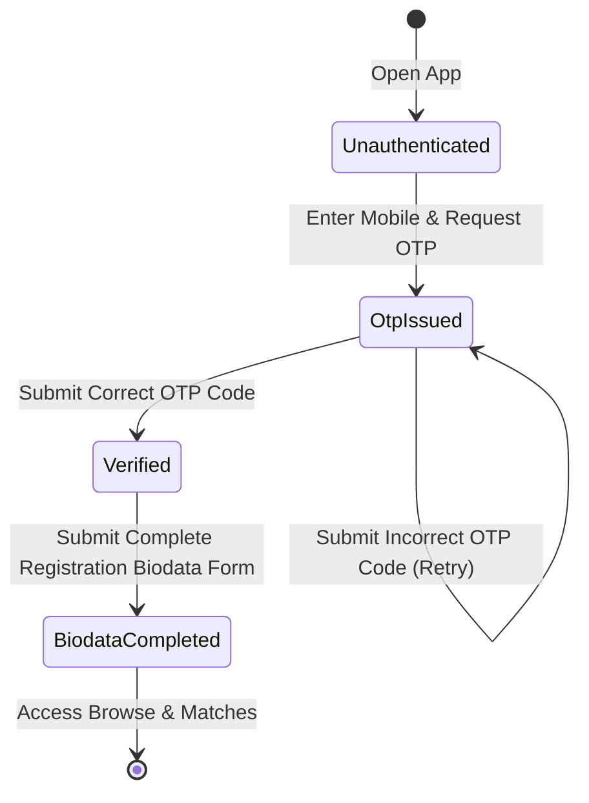

# Data Models: Mithila Matrimony

This document defines the schemas, validations, and states for the primary entities in the **Mithila Matrimony** application.

---

## 1. UserProfile

Represents an authenticated account in the system, maintaining security status and registration progression.

### Entity Schema (TypeScript / JSON)
```typescript
interface UserProfile {
  userId: string;          // UUID v4 format
  mobileNumber: string;    // E.164 formatted telephone number (e.g. +91XXXXXXXXXX)
  isVerified: boolean;     // True if OTP verification succeeded
  registrationStep: 'auth' | 'biodata' | 'completed'; // Current signup wizard step
  registeredAt: string;    // ISO-8601 Timestamp
}
```

### State Transitions


---

## 2. Biodata

Contains the detailed cultural, professional, and personal details of a registered profile.

### Entity Schema (TypeScript / JSON)
```typescript
interface Biodata {
  biodataId: string;       // UUID v4 format
  userId: string;          // Link to UserProfile.userId
  fullName: string;        // Full Name
  gender: 'Male' | 'Female';
  age: number;             // Valid range: 18 to 70
  gotra: string;           // Culturally significant lineage indicator (e.g. Kashyap, Shandilya)
  profession: string;      // Occupation (e.g. Software Engineer, Doctor, Teacher)
  annualIncome: number;    // Annual income in INR (e.g. 1200000)
  location: string;        // Current city (e.g. Darbhanga, Patna, Delhi, Bangalore)
  education: string;       // Highest degree (e.g. B.Tech, MBA, MBBS)
  interests: string[];     // Array of hobbies/interests (e.g. ["Reading", "Cooking", "Travel"])
  photoUrl: string;        // Profile picture link (mocked or loaded locally)
  aboutMe: string;         // Brief bio statement
}
```

### Field Validations
*   `fullName`: Required, string, 3 to 50 characters.
*   `gender`: Required, must be 'Male' or 'Female'.
*   `age`: Required, integer, must be between `18` and `70`.
*   `gotra`: Required, non-empty string.
*   `profession`: Required, non-empty string.
*   `annualIncome`: Required, positive number.
*   `location`: Required, non-empty string.

---

## 3. MatchCriteria

Defines user preferences to search, screen, and calculate compatibility matching scores.

### Entity Schema (TypeScript / JSON)
```typescript
interface MatchCriteria {
  criteriaId: string;      // UUID v4 format
  userId: string;          // Link to UserProfile.userId
  minAge: number;          // Default: 18
  maxAge: number;          // Default: 70
  allowedGotras: string[]; // List of gotras desired (empty means any)
  allowedLocations: string[]; // List of cities desired (empty means any)
  allowedProfessions: string[]; // List of occupations desired (empty means any)
}
```

### Matching Score Formula
For the mock matching engine, profiles are rated based on alignment:
1.  **Gotra Compatibility**: If `allowedGotras` is set, matching gotra adds **40 points**. If empty, **40 points** defaults to all.
2.  **Age Compatibility**: If profile age is within `minAge` and `maxAge`, adds **30 points**.
3.  **Location Compatibility**: If profile location matches `allowedLocations`, adds **30 points**.
- *Compatibity Threshold*: Profiles scoring $\ge 70$ points are considered "Matching Profiles".
